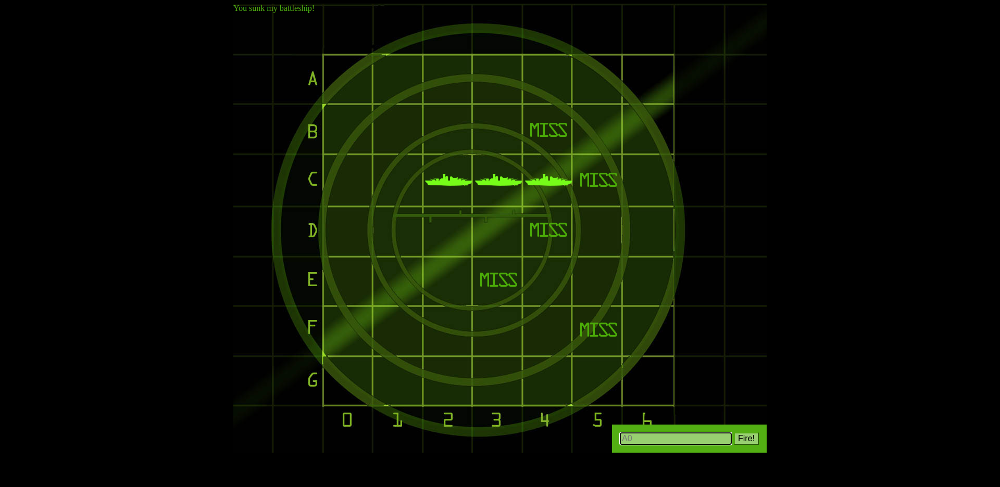
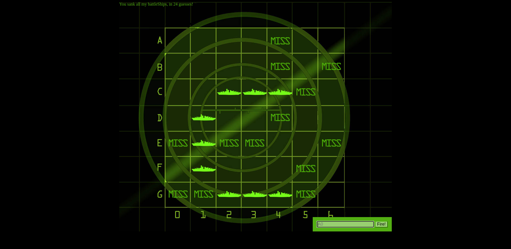

<h1 align="center">Гра морський бій на JS!</h1>
<h2 align="center">
  Цей код було взято з переробленого прикладу восьмого розділу книги <q>Head First JavaScript Programming</q>.
</h2>

  Код виступає для повторення усіх вивчених тем JavaScript

<h3>Результати гри</h3>

<h3>Логіка гри:</h3>

<ol>
	<li>
		Після повної загрузки сторінки визивається функція init
		і чекає поки користувач не натисне кнопку Fire! або Enter.
	</li>
	<li>
		Коли користувач натискає кнопку - функція init визиває 
		обробник кнопки(функція handleFireButton).
	</li>
	<li>
		Обробник отримує дані з форми та передає їх контролеру.
	</li>
	<li>
		Об'єкт контроллера зв'язує всі остальні компоненти,
		отримуючи координати пострілу, обробляя їх (провидить перевірку) і передаю моделі.
	</li>
	<li>
		Об'єкт моделі по черзі визиває методи для знаходження результату пострілу 
		(влучення або промах), наступний метод перевіряє чи потоплен корабель в разі влучення.
	</li>
	<li>
		Об'єкт моделі визиває методи об'єкта view для оновлення інформації
		на варітуальній дошці (влучення або промах).
	</li>
	<li>
		Після оновлення даних, управління знову передається до контролеру,
		який перевіяє чи втоплені всі кораблі і якщо так, закінчує гру.
	</li>
<ol>
